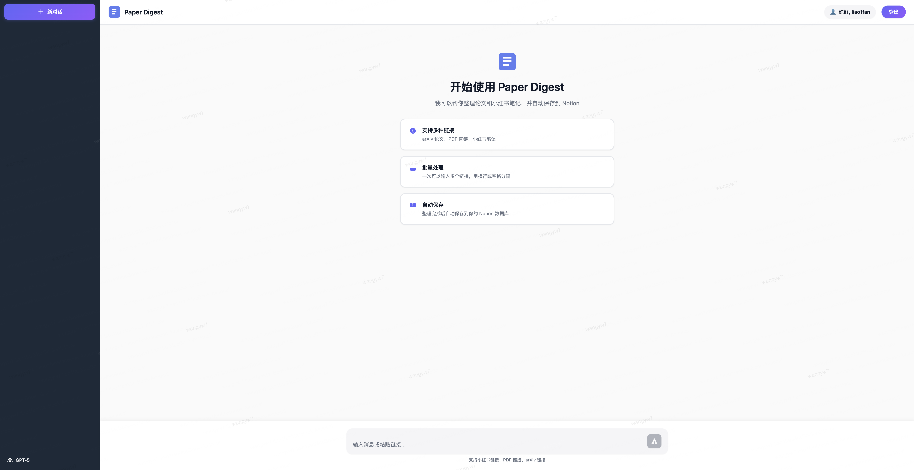

# PaperMind

Intelligent research paper management system. Extract papers from Xiaohongshu/arXiv/PDF, organize metadata, extract figures, generate bilingual summaries, and save to Notion.

## Quick Start

### 1. Install PDFFigures2 (Figure Extraction)

**macOS:**
```bash
brew install openjdk@11
echo 'export PATH="/opt/homebrew/opt/openjdk@11/bin:$PATH"' >> ~/.zshrc
source ~/.zshrc
```

**Linux:**
```bash
sudo apt-get install openjdk-11-jdk
```

### 2. Setup

```bash
python3 -m venv .venv
source .venv/bin/activate
pip install -r requirements.txt
cp .env.example .env
```

Edit `.env` with your credentials (OpenAI API key, Notion token, etc.)

### 3. Run

**CLI mode:**
```bash
python chat.py
```
Provide a paper link (Xiaohongshu URL, arXiv link, or PDF URL).

**Web interface:**
```bash
python web_server.py
```
Open browser to `http://localhost:5000` and use the web interface.



## Architecture

```
User Input
  ↓
Paper Agent (Route link type)
  ↓
Digest Agent (Extract metadata + figures + summary)
  ↓
Notion Database
```

## Features

- **Multi-source input**: Xiaohongshu posts, arXiv links, PDF URLs
- **Metadata extraction**: Title, authors, abstract, venue, keywords (LLM-powered)
- **Figure extraction**: High-quality 300 DPI via PDFFigures2 + Python fallback
- **Bilingual summaries**: English + Chinese with natural image references
- **Notion integration**: Automatic save with full formatting
- **Smart filtering**: Auto-exclude appendix figures
- **Deduplication**: Track processing history

## Project Structure

```
├── README.md
├── requirements.txt
├── .env.example
├── paper_agents.py          # Agent definitions
├── chat.py                  # CLI entry point
├── web_server.py            # Web interface entry point
├── init_model.py            # LLM config
├── pdffigures2/pdffigures2.jar
├── src/
│   ├── services/
│   │   ├── paper_digest.py  # Core agent & processing
│   │   ├── pdf_figure_extractor_v2.py
│   │   ├── xiaohongshu.py
│   │   └── notion_markdown_converter.py
│   ├── utils/
│   │   ├── logger.py        # structlog configuration
│   │   └── retry.py
│   ├── models/
│   └── auth/
├── paper_digest/            # Outputs
└── data/                    # Processing records
```

## Configuration

| Variable | Description |
|----------|-------------|
| `OPENAI_API_KEY` | OpenAI API key |
| `OPENAI_BASE_URL` | API endpoint |
| `XHS_COOKIES` | Xiaohongshu session |
| `NOTION_TOKEN` | Notion integration token (starts with `ntn_`) |
| `NOTION_DATABASE_ID` | Notion database ID |
| `LOG_LEVEL` | INFO, DEBUG, WARNING |

## Troubleshooting

**Java not found:**
```bash
brew install openjdk@11
export PATH="/opt/homebrew/opt/openjdk@11/bin:$PATH"
```

**PDFFigures2 jar missing:** Verify `pdffigures2/pdffigures2/pdffigures2.jar` exists

**Notion connection failed:**
- Check NOTION_TOKEN starts with `ntn_`
- Verify Integration is connected to database

**XHS cookies expired:** Update `XHS_COOKIES` in `.env` from browser DevTools

## Tech Stack

- **Framework**: OpenAI Agents SDK + Python 3.11+
- **Figure Extraction**: PDFFigures2 (Java) + PyMuPDF fallback
- **Database**: Notion API
- **HTTP**: httpx (async)
- **Logging**: structlog (JSON)

## Usage Examples

**Via CLI:**
```bash
python chat.py
# Then paste: https://arxiv.org/abs/2503.08026
```

**Via Python:**
```python
from paper_agents import paper_agent

# Execute with link
result = await paper_agent.execute("https://arxiv.org/pdf/2503.08026.pdf")
```

**Extract figures directly:**
```python
from src.services.pdf_figure_extractor_v2 import extract_pdf_figures

figures, _ = extract_pdf_figures("paper.pdf", output_dir="./figures")
```

## Development

Extend figure extraction in `src/services/pdf_figure_extractor_v2.py`:
- Line 166: `_run_pdffigures2()` - PDFFigures2 execution
- Line 258: `_extract_regionless_figures()` - Python fallback
- Line 457: `_extract_all_figures_python()` - Full fallback

Customize paper digest in `src/services/paper_digest.py`:
- Line 1043: Caption format (English + Chinese)
- Line 1119: Image reference phrases
- Line 1185: Notion block generation
